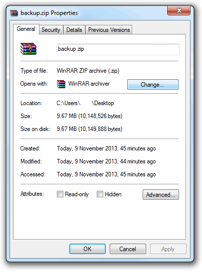

# HTTP Downloader FAQ
This section describes several frequently asked questions and its answers to easily troubleshoot your problem. If you still can't find a solution for your problem, you can always mail us at resonance00x0@gmail.com

### How to find exact size of failed file in bytes
You will need to find the exact size of files (_in bytes_) to resume a download failed from another device. Also, if you use [Advanced mode](advanced-mode), you will need to find file size in bytes. See image below 

#### In Android (Note that these steps may vary based on apps used)
 - Download & install some geek friendly File Explorer apps
 - Locate your required file
 - Touch & hold and select Properties 
 - Find text indicating file size as bytes
 
App used: [X-plore File Manager](https://play.google.com/store/apps/details?id=com.lonelycatgames.Xplore)

#### In Mac OS
 - Browse to your required file using finder
 - Right click on the file & choose properties
 - Find text indicating file size as bytes

#### In Windows
 - Browse to your required file using windows file explorer
 - Right click on the file & choose properties
 - Find text indicating file size as bytes

#### In linux
 - You already know how to find file size in bytes